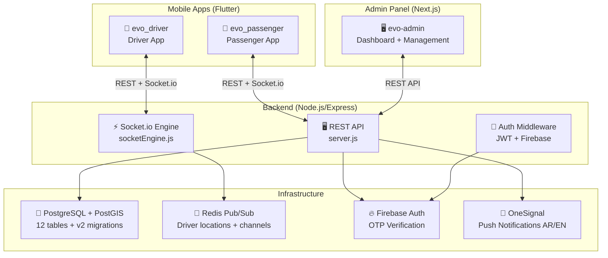
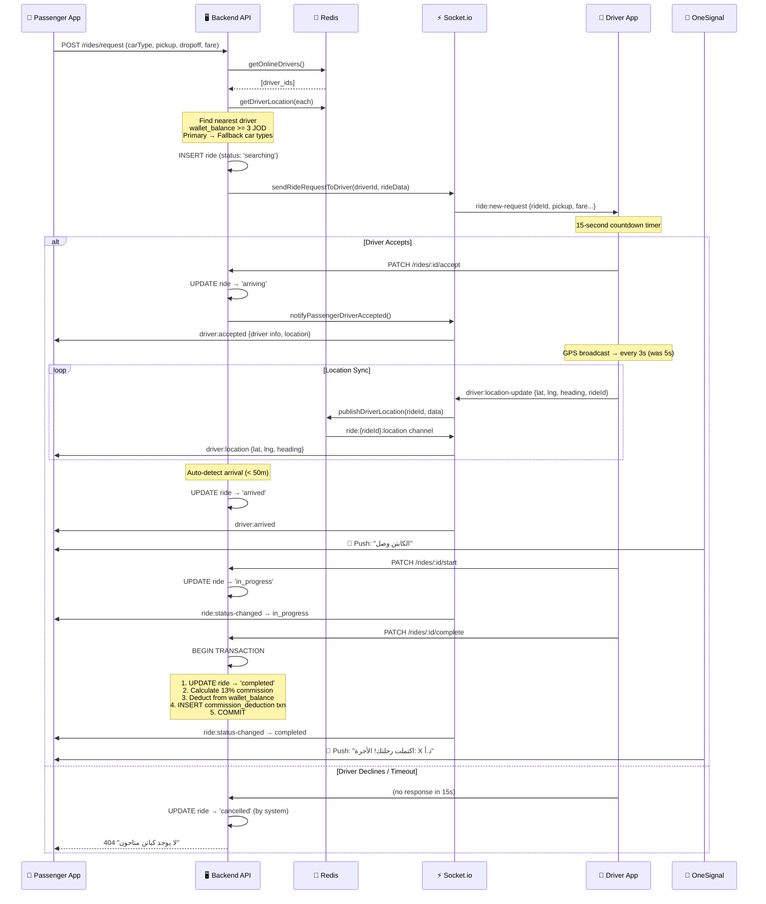
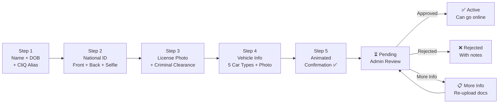
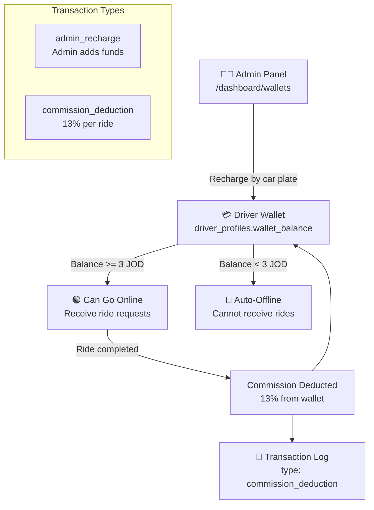
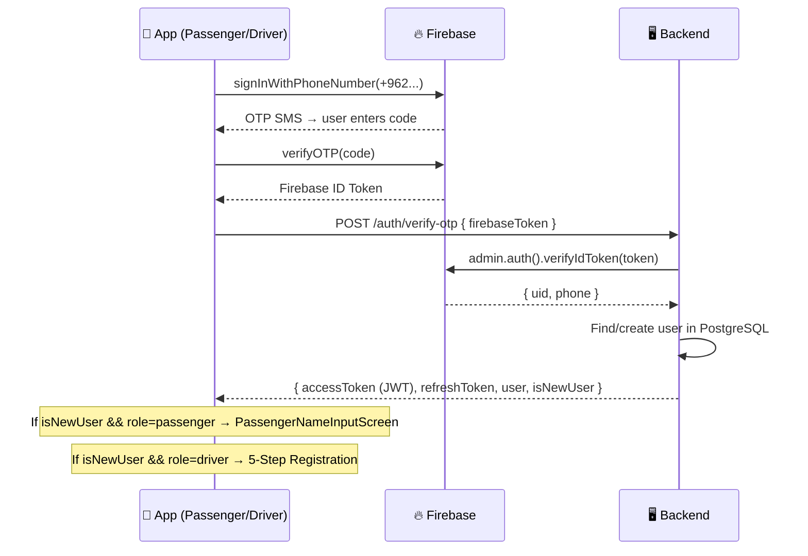

# EVO — Complete Implementation Plan
## Electric Vehicle On-demand Ride-Hailing Platform (Jordan)

> **Document Version**: 2.0 (Rebuilt from codebase audit)
> **Last Updated**: 2026-06-17
> **Status**: Phase 4 in progress, Phases 1-2 complete

---

## 📐 System Architecture Overview



---

## 📂 Project Structure

```
EVO/
├── evo_passenger/          # Flutter — Passenger mobile app
│   └── lib/
│       ├── core/           # Colors, theme, DI, router, API endpoints
│       ├── features/
│       │   ├── auth/       # OTP login + name input
│       │   └── passenger/
│       │       ├── home/   # Map, search, vehicle selector, CO2 badge
│       │       ├── ride_booking/  # BookingBloc, fare estimate
│       │       └── ride_tracking/ # Live tracking screen (512 lines)
│       └── l10n/           # Arabic + English ARB files
│
├── evo_driver/             # Flutter — Driver mobile app
│   └── lib/
│       ├── core/           # EvoColors, dark theme, DI, router
│       ├── features/
│       │   ├── auth/       # OTP + 5-step registration + approval status
│       │   └── driver/
│       │       ├── home/   # Driver home screen
│       │       ├── presentation/bloc/  # DriverBloc (583 lines)
│       │       ├── presentation/screens/  # Home, in-ride, wallet
│       │       └── wallet/ # Wallet screen
│       └── l10n/           # Arabic + English ARB files
│
├── evo-backend/            # Node.js/Express — REST API + Socket.io
│   ├── server.js           # Entry point (4.8KB)
│   └── src/
│       ├── config/         # database.js, redis.js, firebase.js, onesignal.js
│       ├── controllers/    # 7 controllers (auth, ride, wallet, driver, admin, charging, promo)
│       ├── database/       # migrations.sql (v1: 415 lines) + migrations_v2.sql (228 lines)
│       ├── middleware/      # auth.js (JWT verification)
│       ├── routes/         # index.js (180 lines — all routes)
│       ├── socket/         # socketEngine.js (286 lines — real-time engine)
│       └── utils/          # fareCalculator.js, logger.js
│
├── evo-admin/              # Next.js — Admin Dashboard
│   └── src/
│       ├── app/
│       │   ├── login/      # Admin email/password login
│       │   └── dashboard/
│       │       ├── page.tsx          # Dashboard home + stats
│       │       ├── layout.tsx        # Sidebar + topbar
│       │       ├── drivers/          # All drivers + pending approval
│       │       ├── wallets/          # Prepaid wallet recharge panel
│       │       ├── pricing/          # Dynamic pricing config (5 car types)
│       │       ├── promos/           # Promo code CRUD
│       │       └── rides/            # Rides history + filters
│       └── components/     # EvoLogo.tsx
└── README.md               # Task tracker
```

---

## 🗃️ Database Schema (PostgreSQL + PostGIS)

### V1 Tables (migrations.sql — 12 tables)

| # | Table | Purpose | Key Fields |
|---|-------|---------|------------|
| 001 | `users` | All users (passenger/driver/admin) | `id`, `phone`, `full_name`, `role`, `firebase_uid`, `onesignal_player_id`, `preferred_language` |
| 002 | `driver_profiles` | Driver identity + vehicle + location | `national_id_*`, `license_*`, `car_model`, `car_plate`, `car_type`, `is_online`, `current_lat/lng`, `rating`, `approval_status` |
| 003 | `driver_documents` | Uploaded document tracking | `document_type`, `file_url`, `status` (pending/verified/rejected) |
| 004 | `driver_approval_logs` | Audit trail for approvals | `action` (submitted/approved/rejected/more_info) |
| 005 | `rides` | Complete ride lifecycle | `passenger_id`, `driver_id`, `pickup_*`, `dropoff_*`, `status`, `car_type`, `fare breakdown`, `promo`, `timestamps` |
| 006 | `transactions` | Financial ledger | `type`, `amount`, `balance_after`, `recharged_by` |
| 007 | ~~`payment_cards`~~ | **DROPPED in v2** | — |
| 008 | `promo_codes` | Discount codes | `code`, `discount_type`, `discount_value`, `max_per_user`, `applicable_car_types[]` |
| 009 | `pricing_config` | Per-car-type pricing | `base_fare`, `per_km_rate`, `per_min_rate`, `min_fare`, `commission_pct` |
| 010 | `surge_zones` | PostGIS polygon surge areas | `polygon`, `surge_multiplier`, `active_from/until` |
| 011 | `charging_stations` | EV charging (OCM + manual) | `lat/lng`, `charger_types[]`, `source` (opencharge_map/manual) |
| 012 | `admin_audit_logs` | Admin action audit | `action`, `target_type`, `details (JSONB)` |

### V2 Migrations (migrations_v2.sql — Critical Updates)

| Change | Details |
|--------|---------|
| **5 Car Types** | `ev_mini`, `ev_taxi`, `ev_sedan`, `ev_suv`, `ev_luxury` (was: ev_basic, ev_luxury, ev_suv) |
| **Prepaid Wallet** | `wallet_balance`, `total_recharged`, `total_commission_paid` added to `driver_profiles` |
| **CliQ Alias** | `cliq_alias` added (mandatory for drivers) |
| **Cash Only** | `payment_method` locked to `'cash'` only |
| **Commission** | `commission_amount`, `commission_deducted` added to `rides` |
| **EV TAXI** | `tariff_type` (day/night), `waiting_minutes`, night tariff columns on `pricing_config` |
| **Dropped** | `payment_cards` table, `bank_name/bank_iban` from `driver_profiles` |

### V2 Pricing Seeds

| Car Type | Base | /km | /min | Min Fare | Commission |
|----------|------|-----|------|----------|------------|
| `ev_mini` | 0.350 | 0.280 | 0.030 | 1.20 JOD | 13% |
| `ev_taxi` | 0.450 | 0.316 | 0.060 | 1.00 JOD | 13% |
| `ev_sedan` | 0.380 | 0.290 | 0.030 | 1.30 JOD | 13% |
| `ev_suv` | 0.400 | 0.340 | 0.040 | 1.50 JOD | 13% |
| `ev_luxury` | 0.500 | 0.450 | 0.060 | 2.50 JOD | 13% |

> **EV TAXI Night Tariff** (22:00–06:00): base 0.462, /km 0.389, /min 0.070

---

## 🔄 Ride Lifecycle — Complete Flow



---

## 🚗 Driver Registration Flow (5 Steps)



### RegistrationBloc Events & States

| Events (6) | States (8) |
|------------|------------|
| `SubmitStep1Event` (name, DOB, CliQ) | `RegistrationInitialState` |
| `SubmitStep2Event` (ID front/back, selfie) | `RegistrationLoadingState` |
| `SubmitStep3Event` (license, clearance) | `Step1CompletedState` |
| `SubmitStep4Event` (car info, photo) | `Step2CompletedState` |
| `FinalSubmitEvent` | `Step3CompletedState` |
| `CheckStatusEvent` | `Step4CompletedState` |
| | `RegistrationSubmittedState` |
| | `RegistrationErrorState` |

---

## 💰 Prepaid Wallet System



### Key Business Rules

| Rule | Detail |
|------|--------|
| **Minimum Balance** | 3.00 JOD to receive rides |
| **Recharge Method** | Admin recharges by **car plate number** (not driver name) |
| **Commission** | 13% unified across ALL car types |
| **Promo Budget** | 3% of commission budget funds promos — driver always gets full share |
| **Auto-Offline** | DriverBloc detects low balance → emits `LowBalanceState` → goes offline |
| **Atomic Deduction** | `BEGIN → deduct wallet → insert txn → update ride → COMMIT` |

---

## 🔌 Real-Time Engine (Socket.io + Redis Pub/Sub)

### Architecture

```
Driver GPS → Socket.io → Redis SET (driver:{id}:location, TTL 2min)
                       → Redis PUBLISH (ride:{id}:location)
                       → Passenger SUBSCRIBE (ride:{id}:location)
                       → Animated marker update on map
```

### Socket Events

| Event | Direction | Payload |
|-------|-----------|---------|
| `driver:go-online` | Driver → Server | `{ carType }` |
| `driver:go-offline` | Driver → Server | — |
| `driver:location-update` | Driver → Server | `{ lat, lng, heading, speed, rideId? }` |
| `driver:status` | Server → Driver | `{ online: bool }` |
| `ride:new-request` | Server → Driver | `{ rideId, pickup*, dropoff*, carType, fare, passengerName }` |
| `ride:status-changed` | Server → Both | `{ status, rideId, ... }` |
| `driver:accepted` | Server → Passenger | `{ rideId, driver: {...}, status }` |
| `driver:arrived` | Server → Passenger | `{ rideId }` |
| `driver:location` | Server → Passenger | `{ lat, lng, heading, speed, timestamp }` |
| `passenger:track-ride` | Passenger → Server | `{ rideId }` |

### GPS Anti-Spoofing

```javascript
// socketEngine.js — validates location jumps
const valid = isValidLocationUpdate(
    prevLocation.lat, prevLocation.lng, prevLocation.timestamp,
    lat, lng, now
);
if (!valid) {
    logger.warn(`🚨 GPS spoof attempt from driver ${userId}`);
    return; // Drop invalid update
}
```

### Location Broadcast Intervals

| State | Interval |
|-------|----------|
| **Online idle** | Every 5 seconds |
| **In-ride** | Every 3 seconds |
| **Offline** | No broadcast |

---

## 🔐 Authentication Flow



---

## 📱 Passenger App — Feature Map

### ✅ Completed Screens

| Screen | File | Status |
|--------|------|--------|
| OTP Login | `auth_screens.dart` | ✅ Done |
| Name Input (new user) | `passenger_name_input_screen.dart` | ✅ Done |
| Home (Map + Bottom Sheet) | `passenger_home_screen.dart` | ✅ Done |
| Search (Places Autocomplete) | `passenger_search_screen.dart` | ✅ Done |
| Vehicle Selector (5 types) | `ev_type_selector.dart` | ✅ Done |
| CO₂ Badge | `co2_badge.dart` | ✅ Done |
| Driver Marker Animator | `driver_marker_animator.dart` | ✅ Done |
| Ride Tracking (512 lines) | `ride_tracking_screen.dart` | ✅ UI Done (Mock flow) |

### ✅ Completed BLoCs

| BLoC | States | Notes |
|------|--------|-------|
| `AuthBloc` | `AuthInitial`, `AuthLoading`, `AuthVerified`, `AuthError`, `AuthNewUser` | Firebase OTP → JWT |
| `BookingBloc` | `BookingInitial`, `FareEstimated`, `RideRequested`, `RideAccepted`, `RideError` | Fare calc + request |

### ⬜ TODO Screens

| Screen | Priority | Description |
|--------|----------|-------------|
| Wallet & Promo UI | 🔴 High | Show balance, enter promo codes |
| Real-time Tracking | 🔴 High | Connect `ride_tracking_screen.dart` to Socket.io (remove mock flow) |
| Ride History | 🟡 Medium | Paginated list from `GET /rides/history` |
| Ride Rating (standalone) | 🟡 Medium | Currently inside completion sheet — needs BLoC wiring |
| Profile Screen | 🟡 Medium | Name, phone, avatar, preferred language |
| Settings | 🟢 Low | Language toggle, notification preferences |
| In-app Call/Chat | 🟢 Low | Direct call button works, in-app chat is stretch |

---

## 🚗 Driver App — Feature Map

### ✅ Completed Screens

| Screen | File | Status |
|--------|------|--------|
| OTP Login | `auth_screens.dart` | ✅ Done |
| 5-Step Registration | `driver_registration_screens.dart` | ✅ Done |
| Approval Status | `driver_approval_status_screen.dart` | ✅ Done |
| Home Screen | `driver_home_screen.dart` (2 copies) | ✅ Done |
| In-Ride Screen | `driver_in_ride_screen.dart` | ✅ UI Done |
| Wallet Screen | `driver_wallet_screen.dart` + `wallet_screen.dart` | ✅ Done |

### ✅ Completed BLoCs

| BLoC | Events | States | Notes |
|------|--------|--------|-------|
| `AuthBloc` | `VerifyOTP`, `Refresh` | `Initial`, `Loading`, `Verified`, `Error`, `NewUser` | Firebase OTP → JWT |
| `RegistrationBloc` | 6 events (steps 1-4 + submit + check) | 8 states (per-step completed + error) | Multipart upload |
| `DriverBloc` (583 lines) | 13 events | 8 states | **Full ride lifecycle + Socket.io + GPS** |

### DriverBloc — Complete Event/State Map

```
EVENTS:                              STATES:
├── DriverInitializeEvent            ├── DriverInitialState
├── DriverGoOnlineEvent              ├── DriverOfflineState {balance, carType}
├── DriverGoOfflineEvent             ├── DriverOnlineState {balance, carType, lat, lng}
├── DriverLocationUpdatedEvent       ├── IncomingRideState {rideData, secondsLeft}
├── RideRequestReceivedEvent         ├── RideAcceptedState {rideId, status, rideData}
├── RideRequestTimeoutEvent          ├── RideCompletedState {fare, commission, newBalance}
├── AcceptRideEvent                  ├── DriverErrorState {message}
├── DeclineRideEvent                 └── LowBalanceState {balance}
├── MarkArrivedEvent
├── StartRideEvent
├── CompleteRideEvent
├── WalletRefreshEvent
└── DriverDisconnectEvent
```

### ⬜ TODO Screens

| Screen | Priority | Description |
|--------|----------|-------------|
| Navigation to Pickup | 🔴 High | Google Directions API integration after ride accepted |
| Socket.io Live Connection | 🔴 High | Wire DriverBloc Socket.io to actual backend (currently BLoC is ready, needs env config) |
| Charging Stations | 🟡 Medium | Map view with nearby stations from `GET /charging-stations` |
| Driver Profile | 🟡 Medium | View/edit profile, see rating, total rides/earnings |
| Bottom Nav Routing | 🟡 Medium | Home / Rides / Wallet / Profile tabs |
| Earnings Dashboard | 🟢 Low | Daily/weekly/monthly earnings chart |

---

## 🖥️ Admin Dashboard — Feature Map

### ✅ Completed Pages

| Page | Route | File |
|------|-------|------|
| Login | `/login` | `login/page.tsx` |
| Dashboard Home + Stats | `/dashboard` | `dashboard/page.tsx` |
| Driver Approval Queue | `/dashboard/drivers/pending` | `drivers/pending/page.tsx` |
| All Drivers | `/dashboard/drivers` | `drivers/page.tsx` |
| Wallet Recharge | `/dashboard/wallets` | `wallets/page.tsx` |
| Pricing Config | `/dashboard/pricing` | `pricing/page.tsx` |
| Promo Codes | `/dashboard/promos` | `promos/page.tsx` |
| New Promo | `/dashboard/promos/new` | `promos/new/page.tsx` |
| Rides History | `/dashboard/rides` | `rides/page.tsx` |
| Sidebar Layout | — | `dashboard/layout.tsx` |

### ⬜ TODO Pages

| Page | Priority | Description |
|------|----------|-------------|
| Live Driver Tracking Map | 🔴 High | Real-time map showing all online drivers |
| Financial Reports | 🟡 Medium | Revenue, commission, charts by day/week/month |
| Audit Log Viewer | 🟡 Medium | `GET /admin/audit-logs` — display admin actions |
| Surge Zone Editor | 🟢 Low | Map-based polygon editor for surge areas |
| Charging Station Manager | 🟢 Low | CRUD + OpenChargeMap sync |

---

## 🖥️ Backend API — Complete Route Map

### Public Routes

| Method | Endpoint | Controller | Status |
|--------|----------|------------|--------|
| `POST` | `/auth/verify-otp` | `authController.verifyOtp` | ✅ |
| `POST` | `/auth/refresh-token` | `authController.refreshToken` | ✅ |

### Passenger Routes (auth required)

| Method | Endpoint | Controller | Status |
|--------|----------|------------|--------|
| `PATCH` | `/auth/profile` | `authController.updateProfile` | ✅ |
| `GET` | `/rides/nearby-drivers` | `rideController.getNearbyDrivers` | ✅ |
| `POST` | `/rides/estimate` | `rideController.estimateFare` | ✅ |
| `POST` | `/rides/request` | `rideController.requestRide` | ✅ |
| `GET` | `/rides/history` | `rideController.getRideHistory` | ✅ |
| `PATCH` | `/rides/:id/cancel` | Inline handler | ✅ |
| `POST` | `/promo/validate` | `promoController.validatePromo` | ✅ |
| `GET` | `/charging-stations` | `chargingController.getNearbyStations` | ✅ |

### Driver Routes (auth + driver role)

| Method | Endpoint | Controller | Status |
|--------|----------|------------|--------|
| `POST` | `/driver/register/step-1..4` | `driverRegistrationController` | ✅ |
| `POST` | `/driver/register/submit` | `driverRegistrationController.submitRegistration` | ✅ |
| `GET` | `/driver/register/status` | `driverRegistrationController.getRegistrationStatus` | ✅ |
| `PATCH` | `/driver/toggle-online` | Inline handler | ✅ |
| `PATCH` | `/rides/:id/accept` | `rideController.acceptRide` | ✅ |
| `PATCH` | `/rides/:id/arrive` | Inline handler | ✅ |
| `PATCH` | `/rides/:id/start` | `rideController.startRide` | ✅ |
| `PATCH` | `/rides/:id/complete` | `rideController.completeRide` | ✅ |
| `GET` | `/wallet/balance` | `walletController.getBalance` | ✅ |
| `GET` | `/wallet/transactions` | `walletController.getTransactions` | ✅ |

### Admin Routes (auth + admin role)

| Method | Endpoint | Controller | Status |
|--------|----------|------------|--------|
| `POST` | `/admin/login` | Inline (email/password) | ✅ |
| `GET` | `/admin/dashboard/stats` | `adminController.getDashboardStats` | ✅ |
| `GET` | `/admin/users` | `adminController.listUsers` | ✅ |
| `GET/PATCH` | `/admin/users/:id` | `adminController` | ✅ |
| `GET` | `/admin/drivers/pending` | `driverRegistrationController` | ✅ |
| `POST` | `/admin/drivers/:id/approve|reject|request-info` | `driverRegistrationController` | ✅ |
| `GET/PATCH` | `/admin/pricing[/:carType]` | `adminController` | ✅ |
| `GET/POST/PATCH` | `/admin/promo-codes` | `adminController` | ✅ |
| `POST` | `/admin/wallet/recharge` | `walletController.adminRechargeWallet` | ✅ |
| `GET` | `/admin/wallet/balances` | `walletController.adminGetAllBalances` | ✅ |
| `GET` | `/admin/wallet/history/:driverId` | `walletController.adminGetDriverHistory` | ✅ |
| `GET` | `/admin/rides/live` | `adminController.getLiveRides` | ✅ |
| `GET/POST/PATCH` | `/admin/surge-zones` | `adminController` | ✅ |
| `GET/POST/PATCH/DELETE` | `/admin/charging-stations` | `chargingController` | ✅ |
| `POST` | `/admin/charging-stations/sync` | `chargingController.adminSyncFromOCM` | ✅ |
| `GET` | `/admin/financials/summary` | `adminController.getFinancialSummary` | ✅ |
| `GET` | `/admin/financials/transactions` | `adminController.getAllTransactions` | ✅ |
| `GET` | `/admin/audit-logs` | `adminController.getAuditLogs` | ✅ |

---

## 🔑 Key Architecture Decisions (LOCKED — DO NOT CHANGE)

| Decision | Value | Reason |
|----------|-------|--------|
| **Payment** | Cash only | Regulatory simplicity for Jordan launch |
| **CliQ** | Mandatory for all drivers (Step 1) | Admin pays drivers via CliQ |
| **Commission** | 13% unified, ALL car types | 10% net + 3% promo budget |
| **Promo Codes** | 3% from app's commission budget | Driver ALWAYS gets full share |
| **Wallet** | Prepaid by admin (by car plate) | Min 3 JOD to receive rides |
| **Car Types** | `ev_mini`, `ev_taxi`, `ev_sedan`, `ev_suv`, `ev_luxury` | 5 tiers |
| **EV TAXI** | Metered (day 06-22 / night 22-06 tariffs) | No fixed price estimate |
| **Language** | Arabic primary, English secondary | `preferred_language` per user |
| **Fallback Logic** | `ev_mini` → `ev_sedan,ev_taxi,ev_suv` (at mini price) | Driver upgrade, passenger pays lower price |
| **State Management** | BLoC pattern (Flutter) | Clean architecture with Events/States |
| **Design (Driver)** | Dark theme — deep navy + electric green glow | `EvoDarkTheme` |
| **Design (Passenger)** | Light theme — `#F8FAFC` bg + `#1E3F2E` primary | `EvoLightTheme` |

---

## 📊 Progress Summary by Phase

### Phase 1: Foundation ✅ COMPLETE

- [x] Flutter project structure (Clean Architecture, Feature-First)
- [x] Node.js/Express backend (329 packages)
- [x] PostgreSQL + PostGIS — 12 table migrations
- [x] Redis Pub/Sub — driver location caching + channels
- [x] Firebase Auth integration
- [x] OneSignal SDK — AR + EN push templates
- [x] Socket.io engine — 286 lines, full lifecycle
- [x] Core design system (EvoColors, EvoLightTheme, EvoDarkTheme, EvoTypography)
- [x] i18n — `app_ar.arb` + `app_en.arb` (both apps)
- [x] migrations_v2.sql — 5 car types, prepaid wallet, CliQ, cash-only

### Phase 2: Auth & Registration ✅ COMPLETE

- [x] Passenger OTP auth (Firebase → JWT)
- [x] Driver 5-step registration with multipart uploads
- [x] Driver approval status screen (pending/approved/rejected/more_info)
- [x] PassengerNameInputScreen (new user flow)
- [x] RegistrationBloc — 6 events, 8 states
- [x] DI container wiring for both apps
- [ ] **TODO**: Admin push notification on approval/rejection (OneSignal template ready)

### Phase 3: Passenger App Core 🔄 IN PROGRESS

- [x] Home Screen — Google Maps + draggable bottom sheet
- [x] Vehicle class selector (5 types with EV toggle)
- [x] EV Taxi toggle (Day/Night pricing view)
- [x] Live route preview with dynamic fare calculation
- [x] CO₂ savings badge
- [x] Smooth driver marker animation
- [x] Google Places autocomplete
- [x] BookingBloc (ride request flow)
- [x] RideTrackingScreen — UI complete (512 lines, mock flow)
- [ ] **TODO**: Wire RideTrackingScreen to Socket.io (replace `_simulateMockFlow`)
- [ ] **TODO**: Real-time driver tracking (Socket.io → animated marker on map)
- [ ] **TODO**: Wallet & Promo codes UI
- [ ] **TODO**: Ride rating BLoC integration
- [ ] **TODO**: Ride history screen (paginated)
- [ ] **TODO**: Passenger profile screen

### Phase 4: Driver App Core 🔄 IN PROGRESS

- [x] Driver main.dart — Firebase, OneSignal, dark theme
- [x] EvoDarkTheme — deep navy + electric green
- [x] Driver Home Screen (online/offline toggle, wallet card, stats, incoming ride)
- [x] Driver Wallet Screen (balance, transactions, "how it works")
- [x] AuthBloc (OTP + JWT)
- [x] RegistrationBloc (5-step API wiring)
- [x] **DriverBloc** — 583 lines, 13 events, 8 states, full Socket.io lifecycle
- [x] GPS broadcast (5s idle / 3s in-ride)
- [x] Incoming ride 15s countdown
- [x] Accept/decline/arrive/start/complete lifecycle
- [x] Commission auto-deduct on complete
- [x] Low balance detection → auto-offline
- [x] DI container — all BLoCs registered
- [ ] **TODO**: Wire Socket.io to actual backend URL (env config)
- [ ] **TODO**: Navigation to pickup (Google Directions API)
- [ ] **TODO**: Charging Stations screen
- [ ] **TODO**: Driver Profile screen
- [ ] **TODO**: Bottom nav routing

### Phase 4B: Backend ✅ COMPLETE

- [x] walletController.js — prepaid system (5 functions)
- [x] rideController.js — 13% commission deduction (atomic), fallback logic, tariff_type
- [x] routes/index.js — all admin wallet routes, removed bank payouts
- [x] adminController.js — dashboard stats, financials, surge zones, audit logs
- [x] chargingController.js — CRUD + OpenChargeMap sync
- [x] promoController.js — validate + CRUD

### Phase 5: Admin Dashboard ✅ COMPLETE

- [x] Next.js app setup
- [x] Admin login (email/password)
- [x] Dashboard home + stats
- [x] Driver approval queue
- [x] All drivers list (search + filter)
- [x] Wallet recharge panel (by car plate)
- [x] Pricing configuration (5 types, live preview)
- [x] Promo code CRUD
- [x] Rides history (pagination, filters)
- [x] Sidebar navigation (6 nav items)
- [ ] **TODO**: Live driver tracking map
- [ ] **TODO**: Financial reports (charts)
- [ ] **TODO**: Audit log viewer UI

### Phase 6: Polish & Launch ⬜ NOT STARTED

- [ ] Full Arabic RTL testing (both apps)
- [ ] Push notification end-to-end testing
- [ ] Location accuracy testing (real device)
- [ ] Performance profiling (60 FPS target)
- [ ] OpenChargeMap sync for Jordan
- [ ] App Store + Google Play submission
- [ ] Backend deployment (Railway/Render/VPS)
- [ ] PostgreSQL + Redis cloud provisioning
- [ ] SSL + domain setup
- [ ] Load testing

---

## 🎯 Next Steps — Execution Priority

### 🔴 Priority 1 (Critical Path — Must complete before testing)

1. **Wire Passenger RideTrackingScreen to Socket.io** — Replace `_simulateMockFlow()` with real BLoC integration
2. **Wire Driver App Socket.io** — Connect DriverBloc to actual backend URL
3. **Admin push notifications** — Send OneSignal on driver approve/reject
4. **End-to-end ride flow test** — Passenger request → Driver accept → Navigate → Complete → Commission deducted

### 🟡 Priority 2 (Feature complete for MVP)

5. Passenger ride history screen
6. Passenger wallet/promo UI
7. Driver navigation to pickup (Google Directions)
8. Driver bottom nav routing
9. Driver/Passenger profile screens
10. Admin live tracking map

### 🟢 Priority 3 (Polish)

11. Charging stations screen (driver app)
12. Admin financial reports
13. Admin audit log viewer
14. Full RTL testing
15. Performance optimization
16. App store submission

---

## 🛡️ Security Measures (Implemented)

| Measure | Status |
|---------|--------|
| JWT authentication on all routes | ✅ |
| Role-based access control (passenger/driver/admin) | ✅ |
| Firebase phone verification | ✅ |
| GPS anti-spoofing (velocity check) | ✅ |
| Atomic wallet transactions (BEGIN/COMMIT/ROLLBACK) | ✅ |
| SQL parameterized queries (no injection) | ✅ |
| Ride ownership verification (passenger owns ride) | ✅ |
| Driver approval gate (only approved drivers go online) | ✅ |
| Wallet balance gate (min 3 JOD) | ✅ |
| Admin audit logging | ✅ |

---

> **⚠️ IMPORTANT**: This plan is the SINGLE SOURCE OF TRUTH for the EVO project.
> All future development MUST reference this document.
> DO NOT modify locked architecture decisions without explicit user approval.
